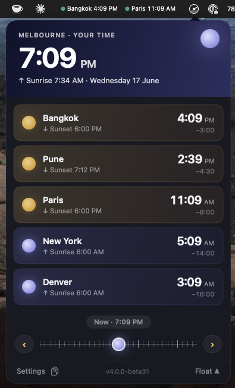
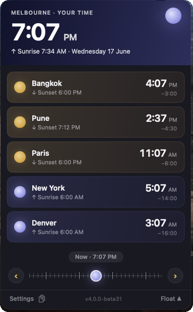
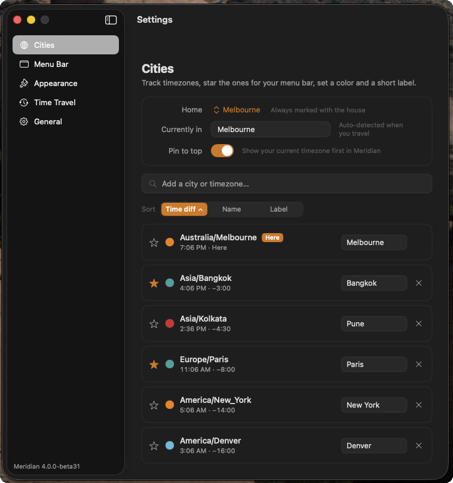
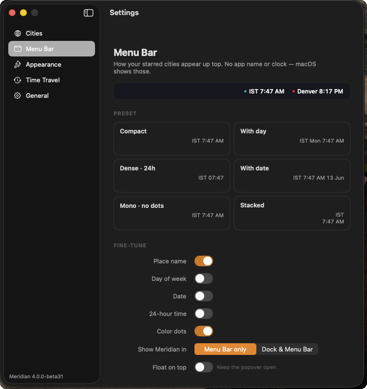
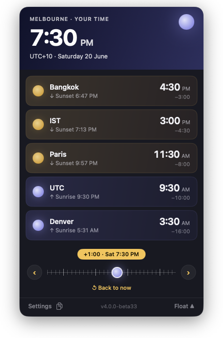
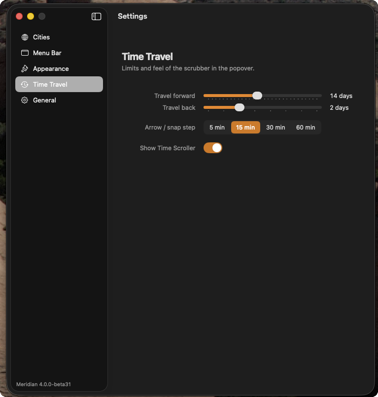
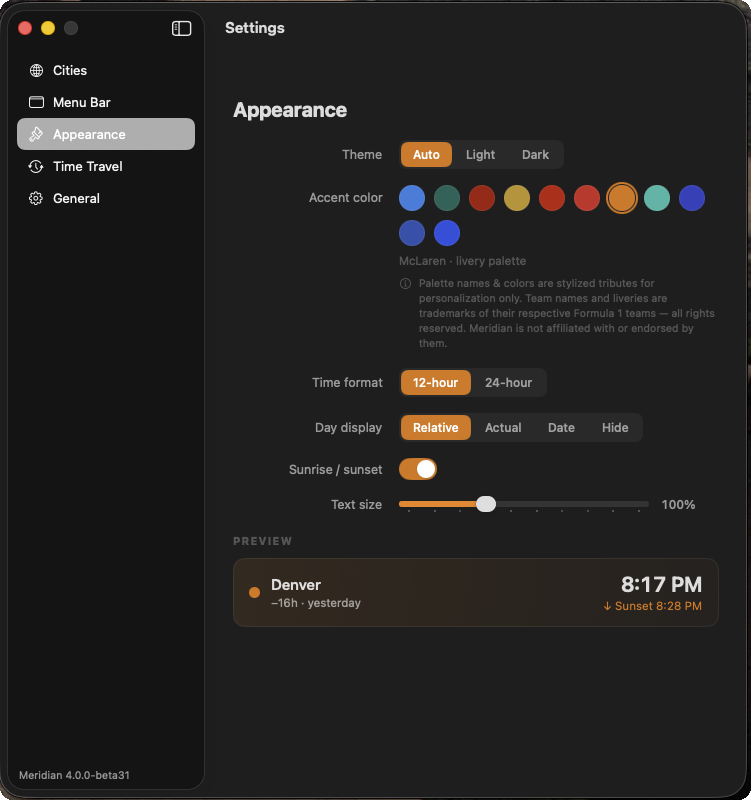
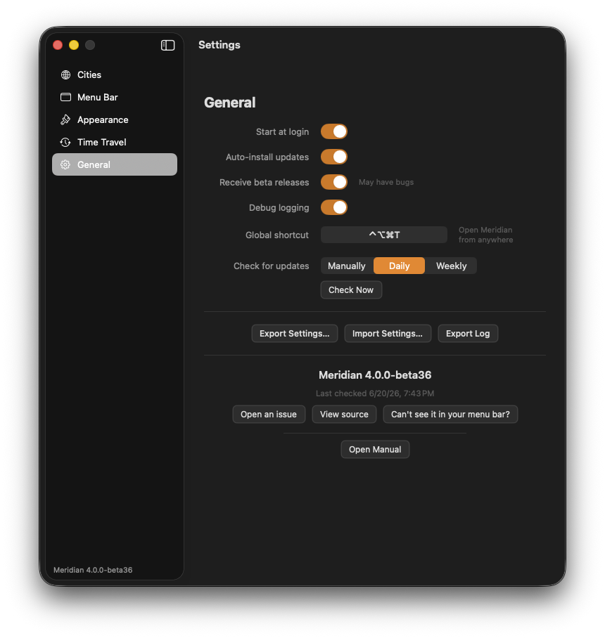

# Meridian — User Manual

**Meridian** is a macOS menu-bar world clock. It keeps the cities you care about a click away, shows you whether it's day or night in each one, and lets you "time-travel" to find a moment that works across time zones. This manual covers everything in version **4.0**.

> New to 4.0? Meridian had a complete redesign called **Daybreak** — a sky that changes with the time of day, live sun/moon indicators, and a brand-new Settings window. If you're upgrading, your cities and preferences carry over automatically.

---



## Contents

- [Installing Meridian](#installing-meridian)
- [First launch](#first-launch)
- [The Daybreak popover](#the-daybreak-popover)
- [Adding & managing cities](#adding--managing-cities)
- [The menu bar](#the-menu-bar)
- [Time travel](#time-travel)
- [Appearance](#appearance)
- [Sunrise, sunset & day/night](#sunrise-sunset--daynight)
- [Updates & the beta channel](#updates--the-beta-channel)
- [Backing up & moving your settings](#backing-up--moving-your-settings)
- [Keyboard shortcuts](#keyboard-shortcuts)
- [Start at login](#start-at-login)
- [Troubleshooting & FAQ](#troubleshooting--faq)
- [Privacy](#privacy)
- [Getting help](#getting-help)

---

## Installing Meridian

The easiest way to install is with [Homebrew](https://brew.sh):

```bash
brew tap tpak/tpak
brew install --cask meridian
```

Or download the latest `.zip` from the [Releases page](https://github.com/tpak/Meridian/releases), unzip it, and drag **Meridian.app** into your **Applications** folder.

Meridian keeps itself up to date automatically, so you only have to install it once. See [Updates & the beta channel](#updates--the-beta-channel).


---

## First launch

When you open Meridian, it appears in your **menu bar** (the strip at the top-right of your screen), not in the Dock. Look for the **Midnight Sundial** icon.

- Meridian automatically adds **your current time zone** so the popover isn't empty.
- **Click the menu-bar icon** to open the Daybreak popover; click again (or press `Esc`) to close it.

### "I can't see the icon" (macOS Tahoe and later)

On recent macOS versions, the system can hide menu-bar apps behind **Control Center**. The first time you launch, Meridian shows a one-time prompt explaining this — click **Open Control Center Settings** and switch Meridian **on**. If the icon ever goes missing later, open **Settings → General → "Can't see it in your menu bar?"** to jump straight back to that screen.

---

## The Daybreak popover

Click the menu-bar icon to drop down the popover — a tidy card anchored under your menu-bar item.



### The hero (your current location)

The top section always shows **where you are right now**:

- A large current time with AM/PM.
- A label like **"DENVER · YOUR TIME"** (or **"… · CURRENT LOCATION"** when you're traveling away from your Home city).
- A **living sky background** that shifts through dawn, day, dusk, and night to match the real time of day where you are, with a **sun or moon** disc in the corner.

Hover over the small sub-line to flip it between the next sun event and a `UTC · weekday date` line.

### City cards

Below the hero, each city you track appears as a card:

- On the left: a **sun/moon** disc (day or night there), the city's name, a **⌂ house badge** if it's your Home, and a small "next sun event" sub-label.
- On the right: that city's **time** and how far **ahead or behind** it is *relative to where you are right now* (e.g. `+11:30`, `-4:30`). A day tag is added when the calendar day differs (e.g. `+11:30 · tmrw`).

Every card's tint reflects whether it's day or night there, and all times update live every second.

### The footer

Along the bottom of the popover:

- **Settings** — opens the Settings window (also `⌘,`).
- **Copy icon** (two overlapping pages) — copies **every** city's name and time to your clipboard, one per line, current location first. The icon flashes a gold checkmark to confirm. (See [Copy all city times](#copy-all-city-times).)
- **Float ▲ / Unfloat ▼** — keeps the popover open and floating above other windows. (See [Float on top](#float-the-popover).)
- The current **version** (e.g. `v4.0.0`).

---

## Adding & managing cities

Open **Settings → Cities** (`⌘,`, then choose **Cities** in the sidebar).



### Add a city or time zone

In the **"Add a city or timezone…"** search field, start typing a city, country, or time-zone name. Results appear below:

- A **pin** icon means a geocoded city (with precise coordinates, for accurate sunrise/sunset).
- A **globe** icon means a raw time zone.

Click a result, or use the **↑ / ↓** arrow keys to highlight one and press **Return** to add it. Press **Esc** to clear the search. You can track up to **100** cities. Duplicate time zones are prevented automatically.

### Each city row

For every city in the list you can:

- **★ Star it** — a filled star means the city appears in your **menu bar**. Only starred cities show in the menu bar.
- **● Set a color dot** — click the colored circle to pick from the palette. This color is the dot shown beside that city in the menu bar.
- **Rename it** — type a personal **Label** (e.g. "Home", "Mom") in the row's text field and press Return. The label replaces the city's name in the popover and menu bar.
- **✕ Remove it** — click the ✕ on the right. (Your auto-detected current-location row can't be removed.)

### Sort the list

Use the **Sort** control to order your cities by **Time diff** (offset from where you are now), **Name**, or **Label**. Click the active option again to flip the direction (the caret toggles up/down). The popover follows the same order as the list.

> The Cities list is sorted with the Sort control rather than dragged in this version.

### Home & current location

The **Locations** card at the top of the Cities pane has:

- **Home** — pick the time zone you consider home. It's always marked with a **⌂ house** badge. When you travel away from Home, the hero switches to "CURRENT LOCATION" and Home appears as a normal city card.
- **Currently in** — your auto-detected current time zone (read-only). Its row is badged **"Here"**. This follows your Mac as you travel.
- **Pin to top** — when on (the default), your current time zone always appears first.

---

## The menu bar

What shows in the menu bar depends on your starred cities:

- **No starred cities** → just the Meridian icon.
- **One or more starred cities** → their times, shown compactly.

Configure this in **Settings → Menu Bar**. A **live preview** at the top of the pane shows your changes before you commit.



### Density presets

Pick a preset card to set everything at once:

| Preset | Example |
|--------|---------|
| **Compact** | `● IST 7:47 AM` |
| **With day** | `● IST Mon 7:47 AM` |
| **Dense · 24h** | `● IST 07:47` |
| **With date** | `● IST 7:47 AM 13 Jun` |
| **Mono · no dots** | `IST 7:47 AM` (no colored dot) |
| **Stacked** | city name stacked over time (two lines) |

The **Stacked** preset puts each city's name above its time, roughly halving the width per city — handy for a crowded or notched menu bar.

### Fine-tune toggles

Below the presets you can switch individual elements on or off: **Place name**, **Day of week**, **Date**, **24-hour time**, and **Color dots**. Adjusting any of these marks the active preset as "custom."

### Where Meridian appears

- **Show Meridian in** — choose **Menu Bar only** (no Dock icon) or **Dock & Menu Bar** (adds a Dock icon). Takes effect immediately.
- When a Dock icon is shown, **right-click** it for quick actions: Toggle Panel, Settings, Check for Updates…, and Hide from Dock.

### Float the popover

The **Float on top** toggle (also available in the popover footer as **Float ▲**) keeps the popover open and above other windows. While floating, **drag it anywhere** by its background; it remembers where you left it. Click **Unfloat ▼** to re-anchor it under the menu-bar icon.

---

## Time travel

Meridian lets you slide time forward and back to find a moment that works everywhere — all your cities update together.



### In the popover

- **Drag the sun/moon handle** along the ruler below the city cards to glide across your travel window — the full **Travel forward / back** range you set in Settings (by default about **2 days back to 6 days ahead**). "Now" sits at the center of the ruler, the past to its left and the future to its right. A pill above the track shows the offset and the resulting time (e.g. `+3:00 · 10:47 PM`, or `+2d · Wed 8:00 AM` further out). The handle's glyph flips between sun and moon as cities cross sunrise/sunset. A deliberate drag is required, so a stray click won't move it.
- **Nudge arrows (‹ ›)** step the time by your **snap step** (5, 15, 30, or 60 minutes) — the precise way to land on an exact moment when the ruler spans many days.
- **Type a time to jump to it.** Double-click any time in the popover — the hero time or a city's time — and type a new one (`3:30 PM`, `15:30`, `3pm` all work). Press **Return** and every clock recomputes so that city reads the time you entered.
- **↺ Back to now** appears while you're traveling — click it to snap back to the present. Closing and reopening the popover also resets to now.

### Settings → Time Travel



- **Travel forward** — how far ahead the scrubber reaches (and how far a typed time can jump): **1–30 days**; default 6.
- **Travel back** — how far back the scrubber reaches: **0–7 days**; `0` turns travel into the past off; default 2.
- **Arrow / snap step** — the increment for the nudge arrows and grid alignment: **5 / 15 / 30 / 60 minutes** (default 15).
- **Show Time Scroller** — show or hide the scrubber in the popover.

> The scrubber spans your whole **Travel forward / back** window. A wide range (say 14 days forward) packs a lot of time into a small ruler, so dragging makes big, quick jumps — use the **‹ ›** arrows, or type a time directly, to land on an exact moment.

---

## Appearance

Open **Settings → Appearance**. A **PREVIEW** card at the bottom shows your changes live.



- **Theme** — **Auto** (follow macOS), **Light**, or **Dark**. (Default: Light.)
- **Accent color** — pick from a grid of **Formula 1 livery-inspired** palettes (Alpine, Aston Martin, Audi, Cadillac, Ferrari, Haas, McLaren, Mercedes, Racing Bulls, Red Bull Racing, Williams). The accent tints switches, selections, and scrubber highlights. (Default: Aston Martin.) *The palette names and colors are stylized tributes and are not affiliated with or endorsed by any Formula 1 team.* Changing the accent may prompt a quick restart so every control repaints.
- **Time format** — **12-hour** or **24-hour**, applied everywhere (popover, menu bar, copied text). This is the same setting as the Menu Bar pane's 24-hour toggle.
- **Day display** — how each city's day/date label reads: **Relative** (Today/Tomorrow/Yesterday-style), **Actual** (weekday), **Date**, or **Hide**.
- **Sunrise / sunset** — show each city's next sun event (see below). (Default: off.)
- **Text size** — scale the popover's text from **85% to 130%** (default 100%).

---

## Sunrise, sunset & day/night

Meridian computes each city's **sunrise and sunset** from its real coordinates and the date, so the sun/moon discs, sky gradients, and card tints reflect actual day and night — including a short twilight window around dawn and dusk.

Turn on **Settings → Appearance → Sunrise / sunset** to show each city's next event in its row (e.g. `↑ Sunrise 6:46 AM`, `↓ Sunset 8:28 PM`) and in the hero sub-line. When it's off, rows show the UTC offset instead.

> Cities added by searching for a place name have precise coordinates and accurate sun times. A city added as a bare time zone uses an approximation until Meridian backfills its coordinates (usually by the next launch).

---

## Updates & the beta channel

Meridian updates itself using [Sparkle](https://sparkle-project.org). Because it rarely needs to quit, updates install quietly in the background.



In **Settings → General**:

- **Auto-install updates** — when on (the default), new versions download and install automatically.
- **Check for updates** — how often Meridian checks: **Manually**, **Daily**, or **Weekly**. The **Check Now** button checks immediately. The last-checked time is shown in the About block.
- **Receive beta releases** — opt in to pre-release builds. *(These may have bugs.)* Turning it on triggers an immediate check. Beta testers automatically receive the final stable release when it ships, so you're never stuck on a beta.
- **Global shortcut** — record a system-wide hotkey to open/close the popover (defaults to **⌃⌥⌘T**); see [Keyboard shortcuts](#keyboard-shortcuts).
- **About** — shows the version and last-checked time, with buttons to **Open an issue**, **View source**, a recovery link if your menu-bar icon goes missing, and **Open Manual** to open this guide.

---

## Backing up & moving your settings

Everything you've configured — your cities, labels, colors, favorites, and preferences — can be exported to a file and restored later or on another Mac.

In **Settings → General**:

- **Export Settings…** — save a `.json` file (default `~/.meridian/meridian_settings.json`).
- **Import Settings…** — load a previously exported file, replacing your current setup. Older exports from earlier Meridian versions are supported; a file from a *newer* version (or a corrupt file) is rejected with an explanation.

Your **Start at login** preference is included in the export and re-applied to the real login item on import.

### Debug logging

If you're troubleshooting an issue (or a maintainer asks you to):

1. Turn on **Settings → General → Debug logging**.
2. Reproduce the problem.
3. Click **Export Log** to save the log file and reveal it in Finder, then share it.

The log is written to a private, user-only file. Turn debug logging back off when you're done.

---

## Keyboard shortcuts

**While the popover is open:**

| Shortcut | Action |
|----------|--------|
| `⌘,` | Open Settings |
| `Esc` / `⌘W` | Close the popover |
| `⌘C` | Copy your current location's time |
| `⌘Q` | Quit Meridian |
| Double-click a time | Edit it / jump to a specific time |

### Copy all city times

The **copy icon** in the popover footer copies every visible city to the clipboard as plain text, one `City · time` per line (current location first). It reflects any time-travel offset and your 12/24-hour setting — great for pasting "what time is the meeting everywhere" into a message.

### Global hotkey

Meridian has a **system-wide hotkey** that opens or closes the popover from any app. It defaults to **⌃⌥⌘T** (Control-Option-Command-T).

To change it, open **Settings → General → Global shortcut**, click the field, and press your new combination (it must include ⌘, ⌥, or ⌃). The field fills with your accent color while it's listening and shows the recorded keys when you're done. Press **Delete** or **Escape** while recording to clear the shortcut. Your choice is included in **Export/Import Settings**.

---

## Start at login

Turn on **Settings → General → Start at login** to have Meridian launch automatically when you log in to macOS. It uses the modern macOS login-item service — no background helper app. (New installs enable this by default; if you previously turned it off, that choice is respected.)

---

## Troubleshooting & FAQ

**The menu-bar icon disappeared.**
macOS may have hidden it in Control Center. Open **Settings → General → "Can't see it in your menu bar?"** and switch Meridian on. (See [First launch](#first-launch).)

**A city shows the wrong time.**
Make sure you're not still time-traveling — click **↺ Back to now**, or close and reopen the popover. Times are derived from each zone's official rules, including daylight saving.

**Sunrise/sunset isn't showing for a city.**
Turn it on in **Settings → Appearance → Sunrise / sunset**. If a particular city still doesn't show times, it may have been added as a bare time zone without coordinates — remove it and re-add it by searching for the city name, or relaunch to let Meridian backfill coordinates.

**My menu bar is too crowded with cities.**
Star fewer cities, switch to a denser preset (**Dense · 24h** or **Mono**), or use the **Stacked** preset to fit more in a narrow/notched bar.

**How do I show a Dock icon?**
**Settings → Menu Bar → Show Meridian in → Dock & Menu Bar.**

**Where are my settings stored?**
In macOS user defaults for the app, plus any export you create at `~/.meridian/meridian_settings.json`. Use **Export/Import Settings** to back up or migrate.

**How do I reset everything?**
Remove your cities in **Settings → Cities** and reset preferences to taste. For a full reset, export your settings first (as a backup), then reinstall.

---

## Privacy

Meridian is built to respect your privacy:

- **No account, no sign-in, no analytics.** Your cities and preferences stay on your Mac.
- **No third-party servers.** City search and coordinate look-ups use Apple's built-in geocoding on your device.
- The only network activity is **checking for app updates** (Sparkle) against Meridian's public release feed.

---

## Getting help

- **Found a bug or have an idea?** Open an issue: <https://github.com/tpak/Meridian/issues> (also linked from **Settings → General → Open an issue**).
- **Source code:** <https://github.com/tpak/Meridian> (also **Settings → General → View source**).
- **This manual:** <https://tpak.github.io/Meridian/manual.html> (also **Settings → General → Open Manual**).

Meridian is open source, and is a fork of [Clocker](https://github.com/n0shake/Clocker) by Abhishek Banthia.

---

<sub>This manual documents Meridian 4.0. Screenshots are captured from the shipping 4.0.0 build.</sub>
